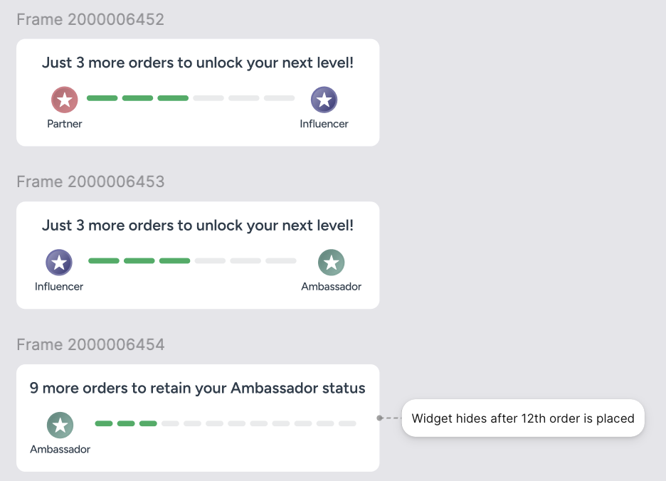

# Loyalty Page API Contracts 

---

## APIs

- [Loyalty Skeleton](#1-loyalty-skeleton)
- [Loyalty Header](#2-loyalty-header)
- [Loyalty Brew Journey](#3-loyalty-brew-journey)
- [Unlocked Loyalty Benefits](#4-unlocked-loyalty-benefits)
- [Locked Loyalty Benefits](#5-locked-loyalty-benefits)
- [Loyalty FAQ](#6-loyalty-faq)
- [Loyalty Progress Widget for App Scan Bottom Sheet](#7-loyalty-progress-widget-for-app-scan-bottom-sheet)

---

## Tier Enum

```json
"PARTNER"
"INFLUENCER"
"AMBASSADOR"
```

---


## 1. Loyalty Skeleton

Returns widget skeleton configuration for loading states.

**URL:** `/api/v1/loyalty/skeleton`

**Method:** `GET`

### Response Body (Success)


For PARTNER

```json
{
  "meta": {
    "request_id": "550e8400-e29b-41d4-a716-446655440000",
    "timestamp": "2026-01-21T14:32:00Z",
    "version": "1.0",
    "end_point": "/api/v1/loyalty/skeleton",
    "cacheable": true
  },
  "data": {
    "skeleton": [
      {
        "widget_name": "loyalty_header",
        "view_type": "header_card"
      },
      {
        "widget_name": "brew_journey_status",
        "view_type": "stepper_card"
      },
      {
        "widget_name": "locked_tier_benefits", 
        "view_type": "grid_layout" 
      },
      {
        "widget_name": "loyalty_faqs",
        "view_type": "accordion_list"
      }
    ]
  }
}
```

For INFLUENCER

```json
{
  "meta": {
    "request_id": "550e8400-e29b-41d4-a716-446655440000",
    "timestamp": "2026-01-21T14:32:00Z",
    "version": "1.0",
    "end_point": "/api/v1/loyalty/skeleton",
    "cacheable": true
  },
  "data": {
    "skeleton": [
      {
        "widget_name": "loyalty_header",
        "view_type": "header_card"
      },
      {
        "widget_name": "unlocked_tier_benefits", 
        "view_type": "carousel" 
      },
      {
        "widget_name": "locked_tier_benefits", 
        "view_type": "grid_layout" 
      },
      {
        "widget_name": "loyalty_faqs",
        "view_type": "accordion_list"
      }
    ]
  }
}
```

For AMBASSADOR

```json
{
  "meta": {
    "request_id": "550e8400-e29b-41d4-a716-446655440000",
    "timestamp": "2026-01-21T14:32:00Z",
    "version": "1.0",
    "end_point": "/api/v1/loyalty/skeleton",
    "cacheable": true
  },
  "data": {
    "skeleton": [
      {
        "widget_name": "loyalty_header",
        "view_type": "header_card"
      },
      {
        "widget_name": "unlocked_tier_benefits", 
        "view_type": "carousel" 
      },
      {
        "widget_name": "loyalty_faqs",
        "view_type": "accordion_list"
      }
    ]
  }
}
```

### Response Body(Failure)
```json
{
  "meta": {
    "request_id": "550e8400-e29b-41d4-a716-446655440000",
    "timestamp": "2024-03-21T14:32:00Z",
    "version": "1.0"
  },
  "error": {
    "code": "INTERNAL_ERROR",
    "message": "Failed to fetch widgets data"
  },
  "user_message": {
    "type": "error",
    "display": {
      "style": "toast"
    },
    "content": {
      "title": null,
      "message": "Unable to fetch widgets data at the moment, please try again later"
    }
  }
}
```


---

## 2. Loyalty Header

Returns user profile and current tier information for the page header.

## Status Enum

```json
"CURRENT"
"COMPLETED"
"LOCKED"
```


**URL:** `/api/v1/loyalty/header`

**Method:** `GET`

### Response Body (Success) - Partner

```json
{
  "meta": {
    "request_id": "550e8400-e29b-41d4-a716-446655440001",
    "timestamp": "2026-01-21T14:32:00Z",
    "version": "1.0",
    "end_point": "/api/v1/loyalty/header",
    "cacheable": false
  },
  "data": {
    "header": {
      "current_tier": "PARTNER",
      "display_name": "Partner",
      "profile_image": {
        "url": "https://cdn.waveapp.com/avatars/user_avatar.png"
      },
      "bg_colors": ["#AC6069", "#EC8893"]
    },
    "progression": {
      "progress_message": "2 orders away from becoming an Influencer",
      "style": {
        "filled_color": "#27AE60",
        "unfilled_color": "#F5F1EE"
      },
      "milestones": [
        {
          "tier": "PARTNER",
          "display_label": "Partner",
          "status": "CURRENT",
          "badge": {
            "text": "3/6",
            "bg_color": ["#B2646D", "#E5848E"],
            "border_color":"#D67A85",
            "text_color": "#FFFFFF"
          },
          "order_count_display": {
            "text": "3 orders / 37 days",
            "text_color": "#D67A85"
          },
          "progress": {
            "orders_in_tier": 3,
            "orders_needed": 6,
            "days_in_tier": 37,
            "percentage": 50
          }
        },
        {
          "tier": "INFLUENCER",
          "display_label": "Influencer",
          "status": "LOCKED",
          "badge": {
            "text": "0/6",
            "bg_color": ["#C1C1D4", "#8686B5"],
            "border_color":"#8686B599",
            "text_color": "#FFFFFF"
          },
          "order_count_display": null,
          "progress": null
        },
        {
          "tier": "AMBASSADOR",
          "display_label": "Ambassador",
          "status": "LOCKED",
          "badge": null,
          "order_count_display": null,
          "progress": null
        }
      ]
    },
    "maintenance": {
      "image": {
        "url": "https://cdn.waveapp.com/icons/star_maintenance.png"
      },
      "message": "Make 15 Orders by 9 March, to maintain this level."
    }
  }
}
```

### Response Body (Success) - Influencer

```json
{
  "meta": {
    "request_id": "550e8400-e29b-41d4-a716-446655440002",
    "timestamp": "2026-01-21T14:32:00Z",
    "version": "1.0",
    "end_point": "/api/v1/loyalty/header",
    "cacheable": false
  },
  "data": {
    "header": {
      "current_tier": "INFLUENCER",
      "display_name": "Influencer",
      "profile_image": {
        "url": "https://cdn.waveapp.com/avatars/user_avatar.png"
      },
      "bg_colors": ["#74749E", "#464681"]
    },
    "progression": {
      "progress_message": "5 orders away from becoming an Ambassador",
      "style": {
        "filled_color": "#27AE60",
        "unfilled_color": "#F5F1EE"
      },
      "milestones": [
        {
          "tier": "PARTNER",
          "display_label": "Partner",
          "status": "COMPLETED",
          "badge": {
            "text": "6/6",
            "bg_color": ["#B2646D", "#E5848E"],
            "border_color": "#D67A85",
            "text_color": "#FFFFFF"
          },
          "order_count_display": null,
          "progress": {
            "orders_in_tier": 6,
            "orders_needed": 6,
            "days_in_tier": null,
            "percentage": 100
          }
        },
        {
          "tier": "INFLUENCER",
          "display_label": "Influencer",
          "status": "CURRENT",
          "badge": {
            "text": "3/6",
            "bg_color": ["#8686B5", "#C1C1D4"],
            "border_color": "#7B68AE",
            "text_color": "#FFFFFF"
          },
          "order_count_display": {
            "text": "3 orders / 24 days",
            "text_color": "#8787B6"
          },
          "progress": {
            "orders_in_tier": 3,
            "orders_needed": 6,
            "days_in_tier": 24,
            "percentage": 50
          }
        },
        {
          "tier": "AMBASSADOR",
          "display_label": "Ambassador",
          "status": "LOCKED",
          "badge": null,
          "order_count_display": null,
          "progress": null
        }
      ]
    },
    "maintenance": {
      "image": {
        "url": "https://cdn.waveapp.com/icons/star_maintenance.png"
      },
      "message": "Make 15 Orders by 9 March, to maintain this level."
    }
  }
}
```

### Response Body (Success) - Ambassador

```json
{
  "meta": {
    "request_id": "550e8400-e29b-41d4-a716-446655440003",
    "timestamp": "2026-01-21T14:32:00Z",
    "version": "1.0",
    "end_point": "/api/v1/loyalty/header",
    "cacheable": false
  },
  "data": {
    "header": {
      "current_tier": "AMBASSADOR",
      "display_name": "Ambassador",
      "profile_image": {
        "url": "https://cdn.waveapp.com/avatars/user_avatar.png"
      },
      "bg_colors": ["#769F96", "#56867B"]
    },
    "progression": {
      "progress_message": "More than 12 orders within the 90-day cycle",
      "style": {
        "filled_color": "#27AE60",
        "unfilled_color": "#F5F1EE"
      },
      "milestones": [
        {
          "tier": "PARTNER",
          "display_label": "Partner",
          "status": "COMPLETED",
          "badge": {
            "text": "6/6",
            "bg_color": ["#B2646D", "#E5848E"],
            "border_color": "#D67A85",
            "text_color": "#FFFFFF"
          },
          "order_count_display": null,
          "progress": {
            "orders_in_tier": 6,
            "orders_needed": 6,
            "days_in_tier": null,
            "percentage": 100
          }
        },
        {
          "tier": "INFLUENCER",
          "display_label": "Influencer",
          "status": "COMPLETED",
          "badge": {
            "text": "6/6",
            "bg_color": ["#8686B5", "#C1C1D4"],
            "border_color": "#7B68AE",
            "text_color": "#FFFFFF"
          },
          "order_count_display": null,
          "progress": {
            "orders_in_tier": 6,
            "orders_needed": 6,
            "days_in_tier": null,
            "percentage": 100
          }
        },
        {
          "tier": "AMBASSADOR",
          "display_label": "Ambassador",
          "status": "CURRENT",
          "badge": null,
          "order_count_display": {
            "text": "12+ orders / 90 days",
            "text_color": "#659188"
          },
          "progress": {
            "orders_in_tier": 2,
            "orders_needed": null,
            "days_in_tier": 90,
            "percentage": 100
          }
        }
      ]
    },
    "maintenance": {
      "image": {
        "url": "https://cdn.waveapp.com/icons/star_maintenance.png"
      },
      "message": "Make 15 Orders by 9 March, to maintain this level."
    }
  }
}
```

### Response Body(Failure)

```json
{
  "meta": {
    "request_id": "550e8400-e29b-41d4-a716-446655440000",
    "timestamp": "2024-03-21T14:32:00Z",
    "version": "1.0"
  },
  "error": {
    "code": "INTERNAL_ERROR",
    "message": "Failed to fetch Header data"
  }
}
```

---

## 3. Loyalty Brew Journey

**URL:** `/api/v2/homepage/get-data?type=new-user-journey`

**Method:** `GET`

```json
{
  "meta": {
    "request_id": "550e8400-e29b-41d4-a716-446655440000",
    "timestamp": "2024-03-21T14:32:00Z",
    "version": "1.0",
    "end_point": "/api/v2/cart/receiver-details"
  },
  "data" : {
    "title": "Complete 5 orders in 30 days using \n Third Wave app to win an exclusive reward!",
    //below milestore layout, if it is null hide it
    "message_details": {
        "message":"Eligible for orders above ₹399 only",
        "style": {
            "text_color": "#145738"
        }
    },
    // style is for setting background of widget, if bg_image is present render else use bg_color
    "style": {
        "bg_color": "#dbefd7",
        "bg_image": {
            "url": "bg_image.png"
        },
        "progress_color": "#4db436",
        "dotted_line_color": "#656060"
    },
    "info": {
        "cta_text": "Know More",
        "title":"Offer Name",
        "summary_list": [{
          "message": "Rule 1"
        }]
    },
    "tick_image": {
        "url": "tick_img.png"
    },
    "current_progress": 3,
    "total_steps": 5,
    "steps": [
        {
            "message": "Almost there",
            "status":"completed", //up-coming, in-queue
            "image": {
                "url": "img.png"
            }
        }
    ]
  }
}
```

### Response Body(Failure)

```json
{
  "meta": {
    "request_id": "550e8400-e29b-41d4-a716-446655440000",
    "timestamp": "2024-03-21T14:32:00Z",
    "version": "1.0"
  },
  "error": {
    "code": "INTERNAL_ERROR",
    "message": "Failed to fetch progression header data"
  }
}
```

---

## 4. Unlocked Loyalty Benefits

**URL:** `/api/v1/loyalty/unlocked-benefits`

**Method:** `GET`

### Response Body (Success) - Influencer

```json
{
  "meta": {
    "request_id": "550e8400-e29b-41d4-a716-446655440011",
    "timestamp": "2026-01-21T14:32:00Z",
    "version": "1.0",
    "end_point": "/api/v1/loyalty/unlocked-benefits",
    "cacheable": false
  },
  "data": {
    "title": "Influencer Benefits",
    "sub_title": "Your exclusive perks as an influencer",
    "style":{
        "title_color": "#1A1A1A",
        "border_color":"#6A8EB1"
    }
    "tier_benefits": [
      {
        "title": "Referral Discount",
        "image": "https://cdn.waveapp.com/icons/birthday-coffee.png",
        "tag": {
          "label": "Unlimited",
          "bg_color": "#EEA73C",
          "text_color": "#FFFFFF"
        }
      },
      {
        "title": "1 Free Coffee",
        "image": "https://cdn.waveapp.com/icons/birthday-coffee.png",
        "tag": {
          "label": "Claimed",
          "bg_color": "#2C8064",
          "text_color": "#FFFFFF"
        }
      },
      {
        "title": "1 Free Coffee",
        "image": "https://cdn.waveapp.com/icons/birthday-coffee.png",
        "tag": null
      }
    ]
  }
}
```

### Response Body (Success) - Ambassador

```json
{
  "meta": {
    "request_id": "550e8400-e29b-41d4-a716-446655440011",
    "timestamp": "2026-01-21T14:32:00Z",
    "version": "1.0",
    "end_point": "/api/v1/loyalty/unlocked-benefits",
    "cacheable": false
  },
  "data": {
    "title": "Influencer Benefits",
    "sub_title": "Your exclusive perks as an influencer",
     "style":{
        "title_color": "#1A1A1A",
        "border_color":"#6A8EB1"
    }
    "tier_benefits": [
      {
        "title": "Referral Discount",
        "image": "https://cdn.waveapp.com/icons/birthday-coffee.png",
        "tag": {
          "label": "Unlimited",
          "bg_color": "#535388",
          "text_color": "#FFFFFF"
        }
      },
      {
        "title": "1 Free Coffee",
        "image": "https://cdn.waveapp.com/icons/birthday-coffee.png",
        "tag": {
          "label": "Claimed",
          "bg_color": "#535388",
          "text_color": "#FFFFFF"
        }
      },
      {
        "title": "1 Free Coffee",
        "image": "https://cdn.waveapp.com/icons/birthday-coffee.png",
        "tag": null
      }
    ]
  }
}
```


## 5. Locked Loyalty Benefits

Returns current tier benefits and next tier benefits preview.

**URL:** `/api/v1/loyalty/locked-benefits`

**Method:** `GET`

### Response Body (Success) - Partner

```json
{
  "meta": {
    "request_id": "550e8400-e29b-41d4-a716-446655440011",
    "timestamp": "2026-01-21T14:32:00Z",
    "version": "1.0",
    "end_point": "/api/v1/loyalty/locked-benefits",
    "cacheable": false
  },
  "data": {
    "next_tier_benefits": [
    {
      "tier": "INFLUENCER",
      "title": "Unlock Influencer Benefits",
        "style":{
        "title_color":"#FFFFFF",
        "title_bg_color":["#71719C", "#535388"],
        "card_bg_color":["#8989A9", "#54548A"],
        "card_border_color":"#71719B",
        "bg_color":"##FFFFFF",
      },
      "benefits": [
        {
          "title": "Free coffee for your birthday",
          "image": {
            "url": "https://cdn.waveapp.com/icons/birthday-coffee.png"
          },
        },
        {
          "title": "Referral discount",
          "image": {
            "url": "https://cdn.waveapp.com/icons/referral.png"
          },
        },
        {
          "title": "10% of net payable bill amount",
          "image": {
            "url": "https://cdn.waveapp.com/icons/wave-coins.png"
          },
        },
        {
          "title": "1 free coffee",
          "image": {
            "url": "https://cdn.waveapp.com/icons/free-coffee.png"
          },
        }
      ]
    }
    {
      "tier": "AMBASSADOR",
      "title": "Unlock Ambassador Benefits",
        "style":{
        "title_color":"##FFFFFF",
        "title_bg_color":["##71719C", "##535388"],
        "card_bg_color":["##AC6069", "##EC8893"],
        "card_border_color":"##56568A",
        "bg_color":"#FFFFFF",
      },
      "benefits": [
        {
          "title": "Free coffee for your birthday",
          "image": {
            "url": "https://cdn.waveapp.com/icons/birthday-coffee.png"
          },
        },
        {
          "title": "Referral discount",
          "image": {
            "url": "https://cdn.waveapp.com/icons/referral.png"
          },
        },
        {
          "title": "10% of net payable bill amount",
          "image": {
            "url": "https://cdn.waveapp.com/icons/wave-coins.png"
          },
        },
        {
          "title": "1 free coffee",
          "image": {
            "url": "https://cdn.waveapp.com/icons/free-coffee.png"
          },
        }
      ]
    }
    ]
  }
}
```

### Response Body (Success) - Influencer

```json
{
  "meta": {
    "request_id": "550e8400-e29b-41d4-a716-446655440011",
    "timestamp": "2026-01-21T14:32:00Z",
    "version": "1.0",
    "end_point": "/api/v1/loyalty/benefits",
    "cacheable": false
  },
  "data": {
    "next_tier_benefits": [
    {
      "tier": "AMBASSADOR",
      "title": "Unlock Ambassador Benefits",
      "style":{
        "title_color":"##FFFFFF",
        "title_bg_color":["##71719C", "##535388"],
        "card_bg_color":["##AC6069", "##EC8893"],
        "card_border_color":"##56568A",
        "bg_color":"##FFFFFF",
      },
      "benefits": [
        {
          "title": "Free coffee for your birthday",
          "image": {
            "url": "https://cdn.waveapp.com/icons/birthday-coffee.png"
          },
        },
        {
          "title": "Referral discount",
          "image": {
            "url": "https://cdn.waveapp.com/icons/referral.png"
          },
        },
        {
          "title": "10% of net payable bill amount",
          "image": {
            "url": "https://cdn.waveapp.com/icons/wave-coins.png"
          },
        },
        {
          "title": "1 free coffee",
          "image": {
            "url": "https://cdn.waveapp.com/icons/free-coffee.png"
          },
        }
      ]
    }
    ]
  }
}
```

---

## 6. Loyalty FAQ

Returns FAQ items for the loyalty program.

**URL:** `/api/v2/loyalty/faq/`

**Method:** `GET`

### Response Body (Success)

```json
{
  "meta": {
    "request_id": "550e8400-e29b-41d4-a716-446655440014",
    "timestamp": "2026-01-21T14:32:00Z",
    "version": "1.0",
    "end_point": "/api/v2/faq/loyalty",
    "cacheable": true
  },
  "data": {
    "title": "FAQs",
    "faqs": [
      {
        "question": "How do I become a Partner?",
        "answer": "You automatically become a Partner when you register on the Wave app. As a Partner, you can start placing orders and progress towards higher tiers."
      },
      {
        "question": "How do I advance to Influencer?",
        "answer": "Place 6 orders within a 90-day cycle to become an Influencer. You'll unlock benefits like 10% Wave Coins on every order and a free birthday coffee."
      },
      {
        "question": "How do I advance to Ambassador?",
        "answer": "Place 12 orders within a 90-day cycle to become an Ambassador. You'll enjoy 15% Wave Coins, 2 free coffees on upgrade, and exclusive birthday benefits."
      },
      {
        "question": "What happens if I don't maintain my tier?",
        "answer": "If you don't place the required orders within your 90-day cycle, you'll be moved to the previous tier. Influencers need 6 orders to maintain, Ambassadors need 12."
      },
      {
        "question": "How long are Wave Coins valid?",
        "answer": "Wave Coins are valid for 1 year from the date they are earned. Use them before they expire!"
      }
    ],
  }
}
```

---


## 7. Loyalty Progress Widget for App Scan Bottom Sheet



**URL:** `/api/v1/loyalty/progress-widget`

**Method:** `GET`

### Response Body - Partner (progressing to Influencer)

```json
{
  "meta": {
    "request_id": "550e8400-e29b-41d4-a716-446655440001",
    "timestamp": "2026-01-21T14:32:00Z",
    "version": "1.0",
    "end_point": "/api/v1/loyalty/progress-widget",
    "cacheable": false
  },
  "data": {
    "current_tier": {
      "tier": "PARTNER",
      "display_label": "Partner",
      "image": {
        "url": "https://cdn.waveapp.com/avatars/partner.png"
      },
    },
    "next_tier": {
      "tier": "INFLUENCER",
      "display_label": "Influencer",
      "image": {
        "url": "https://cdn.waveapp.com/avatars/partner.png"
      },
    },
    "progress": {
      "message": "Just 3 more orders to unlock your next level!",
      "style": {
        "filled_color": "#27AE60",
        "unfilled_color": "#F5F1EE"
      },
      "orders_completed": 3,
      "orders_required": 6,
    }
  }
}
```

### Response Body - Influencer (progressing to Ambassador)

```json
{
  "meta": {
    "request_id": "550e8400-e29b-41d4-a716-446655440002",
    "timestamp": "2026-01-21T14:32:00Z",
    "version": "1.0",
    "end_point": "/api/v1/loyalty/progress-widget",
    "cacheable": false
  },
  "data": {
    "current_tier": {
      "tier": "INFLUENCER",
      "display_label": "Influencer",
      "image": {
        "url": "https://cdn.waveapp.com/avatars/partner.png"
      },
    },
    "next_tier": {
      "tier": "AMBASSADOR",
      "display_label": "Ambassador",
      "image": {
        "url": "https://cdn.waveapp.com/avatars/partner.png"
      },
    },
    "progress": {
      "message": "Just 3 more orders to unlock your next level!",
      "style": {
        "filled_color": "#27AE60",
        "unfilled_color": "#F5F1EE"
      },
      "orders_completed": 3,
      "orders_required": 6,
    }
  }
}
```

### Response Body - Ambassador


```json
{
  "meta": {
    "request_id": "550e8400-e29b-41d4-a716-446655440003",
    "timestamp": "2026-01-21T14:32:00Z",
    "version": "1.0",
    "end_point": "/api/v1/loyalty/progress-widget",
    "cacheable": false
  },
  "data": {
    "current_tier": {
      "tier": "AMBASSADOR",
      "display_label": "Ambassador",
      "image": {
        "url": "https://cdn.waveapp.com/avatars/partner.png"
      },
    },
    "next_tier": null,
    "progress": {
      "message": "9 more orders to retain your Ambassador status",
      "style": {
        "filled_color": "#27AE60",
        "unfilled_color": "#F5F1EE"
      },
      "orders_completed": 6,
      "orders_required": 12,
    },
  }
}
```
